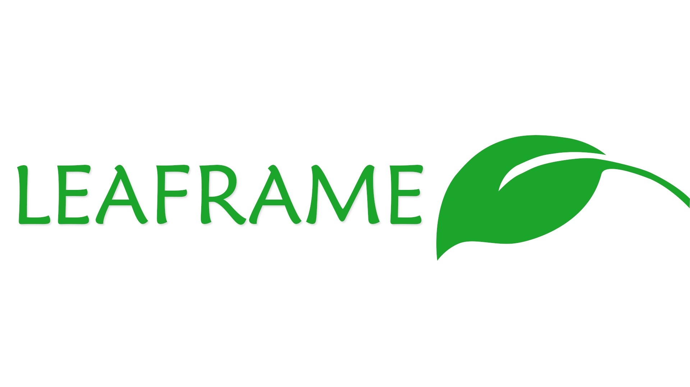

# Leaframe, an Unity UI Toolkit framework

## Overview

Leaframe is an USS framework that provides most of common web features,
with custom controls and navigation system.

## Key features & Roadmap

### Main version

- Base USS theme (buttons, inputs, labels, colors)
- Container with `nth-child`, `empty`, `only-child` and other behaviors (custom control)
- Alert
- TabView
- Badges

### Planned

- Gestures (swipe, long press, drag)
- Modals
- Navigation System 
- Charts (pie, bar, line)

## Installation

The project is built following the Unity package manager recommendation.
You can install it directly from the package manager by following the
official documentation : https://docs.unity3d.com/Manual/upm-ui-giturl.html

1. Go to `Window` > `Package Manager`
2. Click on the "+" button in the upper left corner
3. Click "Add package from git URL..."
4. Paste `https://github.com/DarkRewar/leaframe.git` and apply with "Add" button